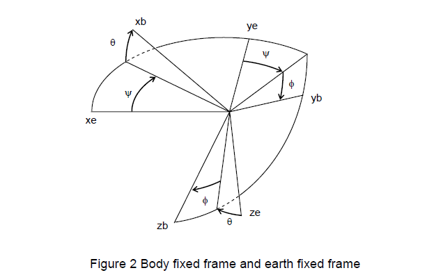
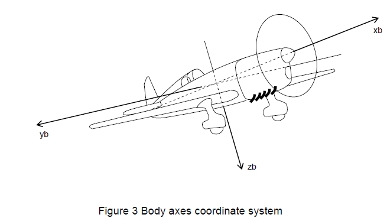

# 轴公约

为了描述飞行器的移动，需要定义一个合适的坐标系统。对于大多是飞行器移动来说，使用两种坐标系。一种是基于地面的坐标系统，其目的是为了分析飞行器运动而建立的惯性系统。另一种是基于飞行器本身的，称为自身坐标系统。Figure 2显示的是这种右手坐标系统。

飞机的方向一般以三个连续旋转量，这三个量的顺序很总要。这三个角参量被称为欧拉角。机体坐标系相对于地面坐标系的方位可以通过接下来的操作确定。假设飞行器固定的使机体坐标平行与地面坐标 然后做以下旋转：
1. 绕zb轴旋转机体得到偏航角\\(\psi\\)
2. 绕yb轴旋转机体得到俯仰角\\(\theta\\)
3. 绕xb轴旋转机体得到横滚角\\(\Phi\\)

