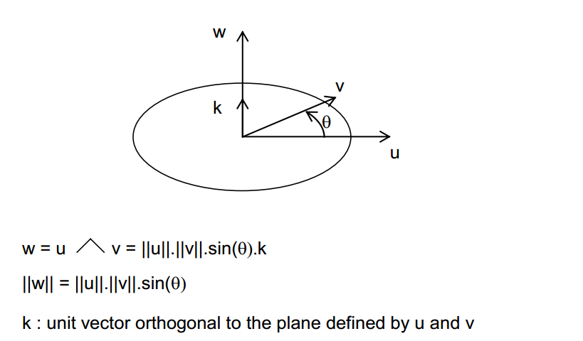

# 向量点叉乘
在计算DCM、使用它的元素进行导航和控制的时候，我们将用到两个非常有用的向量乘法：点乘和叉乘。两个向量A和B的点乘结果是一个标量，通过执行矩阵的乘法——A作为行向量、B作为列向量而被计算出来：

其实两个向量的点乘产生的结果等于两向量模的乘积，乘以两向量夹角的余弦值：

   

注意点乘是可交换的：**A**\\(\cdot\\)**B**=**B**\\(\cdot\\)**A**    
两个向量A、B的叉乘结果是一个向量，这个向量的各个组成部分由下面公式计算出来： 

这个向量垂直于A、B向量，它的模等于两向量模的乘积，乘以夹角的正弦值：

另一方面：

注意叉乘是反交换的：**A**\\(\times\\)**B**=-**B**\\(\times\\)**A**
